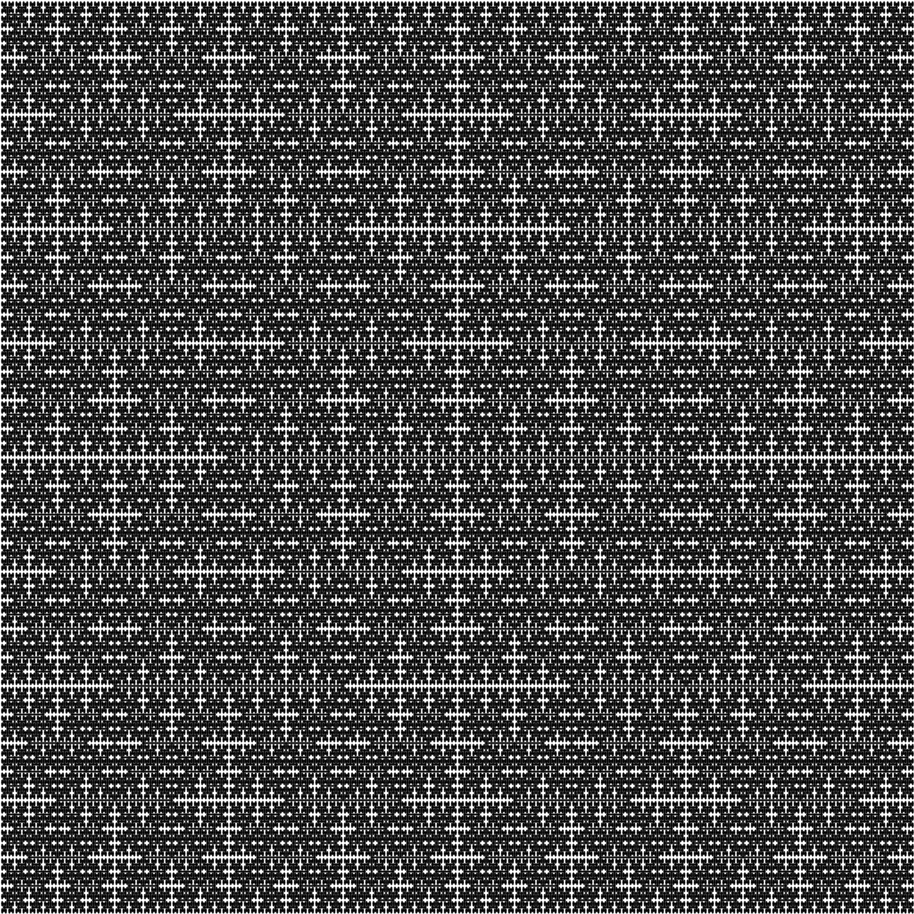

# Java-Art-Graphics

Welcome to the Java-Art-Graphics repository! This repository contains Java code examples for creating captivating art and graphics. Explore the realm of visual creativity with Java and unleash your artistic vision through mesmerizing fractals, intricate designs, and stunning visual effects.

## Examples

### 1. RecursiveSquarePatternDrawer

- [Click Here to See Code](src/RecursiveSquarePatternDrawer.java)
- [Click Here to See Image](images/recursive-square-pattern.png)

Description: This example showcases the creation of a recursive square pattern. It utilizes recursion to draw a series of squares, creating an intricate and visually appealing pattern.

### 2. SquareFractalDrawer

- [Click Here to See Code](src/SquareFractalDrawer.java)
- [Click Here to See Image](images/square-fractal.png)

Description: Experience the mesmerizing beauty of a square fractal. This example demonstrates how to generate a square fractal by recursively dividing a square into smaller squares.

### 3. BranchingPatternDrawer

- [Click Here to See Code](src/BranchingPatternDrawer.java)
- [Click Here to See Image](images/branching-pattern.png)

Description: Delve into the world of branching patterns with this example. It utilizes recursion to draw a captivating branching pattern that resembles tree-like structures.

## Getting Started

To get started, clone this repository and explore the examples in the `examples` directory. Each example includes a corresponding image showcasing the artwork and a link to the source code. Feel free to modify the code and experiment with different parameters to create your own unique art and graphics.

## Requirements

- Java JDK
- StdDraw library

## License

This repository is licensed under the [MIT License](LICENSE).
